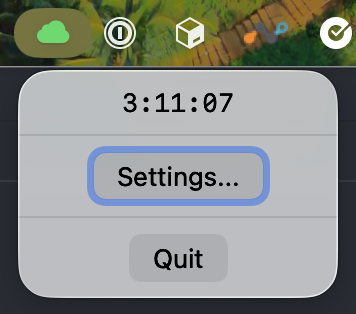

# gcloud-session-watch

A macOS menu bar app that shows how much time remains before your [Google Cloud Application Default Credentials](https://cloud.google.com/docs/authentication/application-default-credentials) session expires.

## What it does

The app reads the modification timestamp of `~/.config/gcloud/application_default_credentials.json` and counts down to the session expiry. The countdown appears directly in the menu bar, and a macOS notification fires when the session expires.

**Menu bar icon:**

| State | Icon colour |
|---|---|
| Valid session | Green |
| Expiring soon (≤ 10 min) | Amber |
| Expired | Red |
| No credentials file | Red |

Click the icon to see a live `H:MM:SS` countdown.



## Requirements

- macOS 13 Ventura or later
- Xcode 15 or later (to build from source)

## Build & Run

1. Open `GcloudSessionWatch.xcodeproj` in Xcode.
2. Select the `GcloudSessionWatch` scheme.
3. Press **Cmd+R**.

The app runs as a menu bar agent with no Dock icon.

## Settings

Click the menu bar item → **Settings...** to configure the session duration (1–24 hours, default 5 hours). Adjust this to match your organisation's `--access-token-file` or `gcloud auth` session length.

## Refreshing credentials

When the session expires, run:

```sh
gcloud auth application-default login
```

This updates the credentials file, and the countdown resets automatically within 30 seconds.

## How it works

- **Polling:** Checks the file modification time every 30 seconds. No filesystem watcher needed.
- **Display timer:** Updates the in-menu countdown every second from a cached expiry date — no extra file I/O.
- **Notification:** Schedules a `UNUserNotificationCenter` alert at the computed expiry time. Cancelled and rescheduled on each poll if the file changes (i.e. after a new login).
- **No network calls, no third-party dependencies.**

## Building a distributable DMG

Requires an Apple Developer Program membership and a Developer ID Application certificate.

```sh
cp ExportOptions.plist.template ExportOptions.plist
# Edit ExportOptions.plist and replace YOUR_TEAM_ID with your Team ID
./scripts/build-dmg.sh
```

The DMG is written to `build/GcloudSessionWatch.dmg`. `ExportOptions.plist` and `build/` are gitignored.

### Regenerating the app icon

The icon was exported from SF Symbols as an SVG, then converted with ImageMagick:

```sh
magick -density 720 -background none key.icloud.fill.svg -resize 1024x1024 AppIcon1024.png
```

## Running tests

```sh
xcodebuild test -scheme GcloudSessionWatch -destination 'platform=macOS'
```
